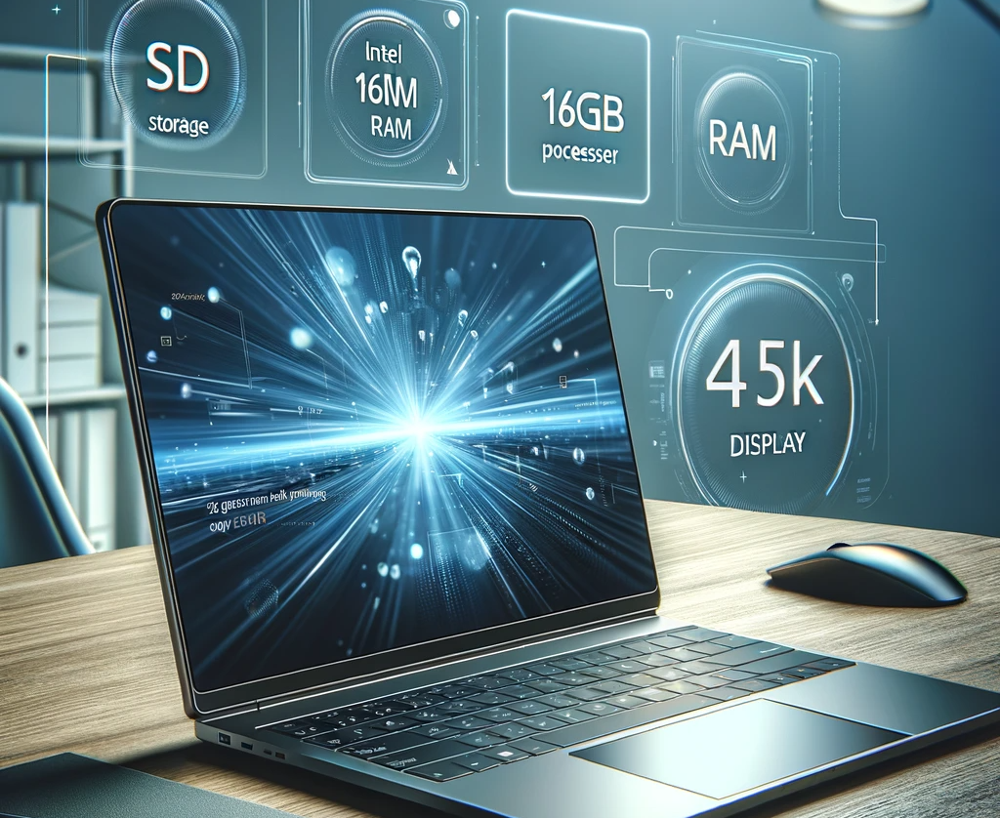

# Laptop Price Predictor
 

> This project is a Laptop Price Predictor built using Machine Learning.
It takes different laptop features as input like RAM, processor, storage, screen size, and more, and predicts the estimated price.

The model is trained on a dataset of laptop specifications and uses feature engineering (like PPI calculation, storage type, CPU brand, etc.) to improve prediction accuracy.

The frontend is built using Streamlit, where users can enter laptop details and get the predicted price instantly.

---

## Project Overview

This application analyzes laptop specifications and predicts the expected price using a trained ML model.

### Key Techniques Used

- Feature Engineering (PPI calculation, CPU/GPU extraction)
- One-Hot Encoding for categorical data
- Log Transformation of target variable
- Regression modeling

---

## Tech Stack

| Layer | Tools |
|-------|-------|
| **Frontend** | Streamlit |
| **Backend / ML** | Python, Scikit-learn |
| **Model** | Random Forest Regressor |
| **Data Processing** | Pandas, NumPy |
| **Visualization** | Matplotlib, Seaborn |

---

## Features

- Predicts laptop price based on specifications
- Interactive UI using Streamlit
- Real-time prediction
- Smart feature engineering
- Laptop category classification (Budget / Mid-range / High-end)
- Displays full input summary
- Ready for deployment

---

## Model Details

| Property | Details |
|----------|---------|
| **Algorithm** | Random Forest Regressor |
| **Dataset** | ~1300+ laptop records |
| **Target** | Price prediction |
| **Transformation** | Log transformation applied (`log(price)`) |
| **Performance** | Close-to-market predictions with low error |

---

## Input Features

| Feature | Options / Type |
|---------|---------------|
| **Brand** | Dell, HP, Apple, Lenovo, etc. |
| **Laptop Type** | Gaming, Notebook, Ultrabook, etc. |
| **RAM** | 4 GB – 64 GB |
| **Storage** | SSD / HDD (size in GB) |
| **CPU & GPU** | Extracted from specs |
| **Screen Size & Resolution** | Inches + PPI calculation |
| **IPS Display & Touchscreen** | Yes / No |
| **Operating System** | Windows, macOS, Linux, etc. |
| **Weight** | In kg |

---

## Demo

> 👉 **Live App:** [https://your-app-name.streamlit.app](https://your-app-name.streamlit.app)


## How to Run Locally

```bash
git clone https://github.com/your-username/laptop-price-predictor.git
cd laptop-price-predictor
pip install -r requirements.txt
streamlit run app.py
```

---

## Future Improvements

- Upgrade to XGBoost for better accuracy
- Add model performance visualization
- Improve UI/UX design
- Add real-time market comparison

---


